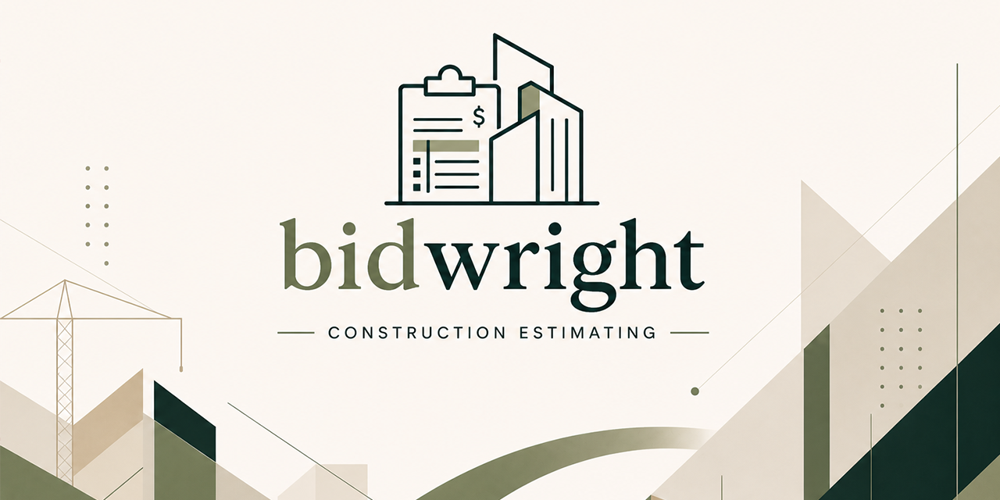

<p align="center">
  
</p>

<h1 align="center">Bidwright</h1>

<p align="center">
  <a href="https://github.com/braedonsaunders/codeflow"></a>
</p>

<p align="center">
  <strong>The estimating platform that runs the whole bid — intake, knowledge, takeoff, pricing, scheduling, review, and quote delivery — on top of an AI agent that actually has hands.</strong>
</p>

<p align="center">
  Drop the bid package. Index the spec. Take off the drawings <em>and</em> the model. Parameterize the assemblies. Price it with real burdens. Let the agent review it. Send the branded quote.
</p>

## Features

### 1. Unified agent orchestration — not a chat box bolted on

Bidwright keeps the LLM provider adapter in `packages/agent`, while estimating actions live in the API, MCP server, and quote workspace services where they share the same cost intelligence, worksheet provenance, labor units, assemblies, review records, and audit trail. The agent can read a worksheet, search current market sources, pull structured cost candidates, validate labor and resource basis, propose phases, edit line items, and write review notes without drifting onto a separate legacy tool path.

Multi-provider out of the box: **Anthropic, OpenAI, OpenRouter, Gemini, LM Studio**. Local embeddings via **Ollama**. Hybrid retrieval over **pgvector**.

### 2. Bring your own coding agent — Claude Code, Codex, OpenCode, & more

Bidwright can spawn a **Claude Code** or **Codex** session against an isolated workspace seeded with the project's documents, knowledge, and CLAUDE.md context. Stream responses, read/write memory, monitor sessions, stop them. The same machinery powers the in-app review feature — and it's exposed at `/api/cli/*` for your own automations.

### 3. MCP server — Bidwright tools in your editor

The `packages/mcp-server` package exposes Bidwright's estimate, knowledge, model, quote, review, system, and vision tools over **Model Context Protocol**. Point Claude Code, Cursor, or any MCP-aware client at it and your estimating data is one tool call away from your IDE.

### 4. 2D takeoff *and* 3D model takeoff — linked to the worksheet

- **2D drawings:** open PDFs, calibrate scale, count/linear/area annotations, symbol detection, multi-page counts, "Ask AI" on a selected region, export markups.
- **3D models:** ingest BIM/CAD, parse element hierarchies (parent/child, material, system, discipline), extract per-element quantities with confidence/method tracking, generate filtered BOMs, and **diff revisions** (baseline vs. head).
- **Both link back to worksheet line items** via `TakeoffLink` and `ModelTakeoffLink` — annotations and 3D elements stay tied to the dollars they drive, with quantity multipliers and override fields.

A dedicated **Model Editor** app (`apps/model-editor/`) ships alongside the main web app for heads-down 3D work, with bidirectional sync to the quote workspace.

### 5. Assemblies — reusable kits with parameters and nested sub-assemblies

Define an assembly once, drop it in a hundred quotes. Each assembly supports:

- **Typed parameters** with defaults and units (`AssemblyParameter`)
- **Quantity expressions** that bind to those parameters (`quantityExpr`, `parameterBindings`)
- **Nested sub-assemblies** (`AssemblyComponent.subAssemblyId`)
- **Per-component overrides** for cost, markup, and UOM
- **Snapshotting** so worksheet items remember the source assembly state at the time of insertion

This is the layer most takeoff tools punt on. It's shipped here.

### 6. Estimate strategy — a structured way to think before you price

Bidwright's `EstimateStrategy` walks a quote through **Scope → Execution → Packaging → Benchmark → Reconcile → Complete**, with:

- A **scope graph** of items, constraints, and alternates with confidence levels
- An **execution plan** (self-perform vs. sub, crew strategy, procurement risk)
- A **package plan** splitting work into detailed / allowance / historical / subcontract by phase
- **Benchmark comparables** against prior projects
- **Assumptions** with evidence and explicit user confirmation flags

You're not just bidding — you're keeping receipts.

### 7. Quote review — the agent reads your bid back to you

Hit review and Bidwright spawns an isolated agent session that ingests the project documents and your estimate, then produces:

- **Coverage** findings (YES / VERIFY / NO) tied to spec evidence
- **Gaps**, **risks**, and **cost anomalies**
- A **competitiveness** score
- **Recommendations** with status tracking (resolve, dismiss, defer)
- An **`EstimateCalibrationFeedback`** record that closes the loop on systematic over/under-pricing

You see exactly which document chunk the finding came from. No hand-waving.

### 8. A real pricing engine, not a unit cost column

- **Rate schedules** with tiered multipliers (regular / overtime / double / custom tiers)
- **Labour cost tables** by trade and role
- **Burden periods** with date-ranged percentages
- **Travel policies** with per diem, mileage, fuel surcharge, accommodation, and embed modes
- **Catalogs** for equipment and material lookups
- **Reusable conditions** library

Built for the estimator who knows that "rate × hours" is the easy part.

### 9. Knowledge that the AI actually uses

Three tiers, all org- or project-scoped:

- **Knowledge Books** — ingested PDFs (estimating books, specs, manuals) chunked, embedded, and searchable
- **Knowledge Documents** — hand-authored pages with structure and metadata
- **Datasets** — structured tables built manually or extracted from books

Bind them to **Estimator Personas** — per-trade AI configurations with system prompts, default assumptions, productivity guidance, and review focus areas — so the agent answers like *your* senior estimator, not a generic LLM.

### 10. Plugins and dynamic tools

Drop in a plugin with a config schema and tool definitions, and it shows up in the agent's tool registry and the UI. Every execution is tracked (input, formstate, output, applied line items) so plugins are auditable, not magic.

### Run Bidwright locally

The only thing you need installed is **Docker Desktop**. The installer
below pulls a few KB of launcher files (compose + start/stop scripts)
into `~/bidwright`, then starts the stack — no source checkout.

**Windows (PowerShell):**

```powershell
iwr -useb https://raw.githubusercontent.com/braedonsaunders/bidwright/main/scripts/launcher/install.ps1 | iex
```

**macOS / Linux:**

```bash
curl -fsSL https://raw.githubusercontent.com/braedonsaunders/bidwright/main/scripts/launcher/install.sh | bash
```

## What's in the box

| Area | Live capabilities |
| --- | --- |
| Package intake | Upload bid packages, unzip archives, classify files, extract text from PDFs, spreadsheets, and text files, preserve tables and key-value structure. |
| Knowledge | Books, documents, datasets, cabinets (org or project scoped), hybrid pgvector search, persona binding, page browsing. |
| Estimating workspace | Projects, quotes, revisions, worksheets, line items, phases, modifiers, conditions, summary rows, notes, lead letters, report sections, activity history, cross-project performance views. |
| Assemblies | Parameterized kits, nested sub-assemblies, quantity expressions, per-component overrides, worksheet snapshotting. |
| 2D takeoff | PDF viewer, scale calibration, count/linear/area annotations, symbol detection, multi-page counts, region "Ask AI", markup export. |
| 3D model takeoff | Element hierarchy ingestion, per-element quantities, BOM generation, revision diffing, worksheet links with multipliers. |
| Scheduling | Tasks, milestones, SS/SF/FS/FF dependencies, calendars, resources, baselines, Gantt views tied to estimate phases. |
| Pricing | Catalogs, tiered rate schedules, labour cost tables, burden periods, travel policies, entity categories, customers, departments, conditions. |
| Quote output | Revision compare, package preview, branded PDF generation with configurable layouts and sections, email delivery. |
| AI & agents | Multi-provider models, 150+ tools, local Ollama embeddings, MCP server, Claude Code / Codex runtime sessions, plugin framework. |
| Quote review | Agent-driven coverage / gap / risk / competitiveness analysis with evidence-linked findings and calibration feedback. |
| Multi-tenant ops | Organizations, users, super-admin setup, org switching, brand profiles, brand capture from website crawl, estimator personas, data import/export, admin flows. |

## Inside the monorepo

```text
apps/
  api/            Fastify API — auth, quote logic, PDF/email, AI/vision routes, CLI runtime
  web/            Next.js app — intake, estimating, takeoff, knowledge, performance, settings
  worker/         BullMQ orchestration for ingestion and reviewable AI workflows
  model-editor/   Standalone 3D model editor with bidirectional worksheet sync

packages/
  agent/        Tool-backed agent runtime, provider adapters, 150+ tools
  ai/           Prompt contracts and typed AI helpers
  db/           Prisma schema (73 models), seeders, templates, db utilities
  domain/       Shared business models and quote logic
  ingestion/    Package extraction, classification, chunking, parsing
  mcp-server/   MCP bridge exposing Bidwright tools to external agents
  vector/       Embeddings and pgvector hybrid retrieval
  vision/       PDF rendering, 2D symbol analysis, 3D model parsing
```

### Develop on Bidwright

If you're going to edit code, you need Node.js 20+, pnpm 10+, and Docker
Desktop. Optionally an OpenAI and/or Anthropic API key.

```bash
pnpm install
cp .env.example .env
pnpm dev
```

`pnpm dev` brings up Postgres, Redis, and Ollama in Docker, generates the Prisma client, pushes the schema, sets up `pgvector`, and launches the web app, API, and worker together.

On Windows:

```powershell
pnpm dev:windows
```

After startup:

- Web: `http://localhost:3000`
- API: `http://localhost:4001`
- If no super admin exists, Bidwright opens the first-run setup wizard. From there, create your org and optionally load sample data.

## Tech stack

- **Frontend:** Next.js 16, React 19, Tailwind CSS, Radix UI
- **API:** Fastify 5
- **Worker orchestration:** BullMQ
- **Database:** PostgreSQL, Prisma, `pgvector`
- **AI:** Anthropic, OpenAI, OpenRouter, Gemini, LM Studio, Ollama embeddings
- **Vision:** Playwright, Python, OpenCV-style 2D symbol pipeline, 3D model parsing
- **Agent runtimes:** Claude Code, Codex, MCP
- **Monorepo:** pnpm workspaces + Turborepo
- **Language:** TypeScript with Zod validation

## Status

Bidwright is a working platform for AI-assisted construction estimating. Core estimating, takeoff (2D and 3D), assemblies, knowledge, pricing, scheduling, review, branding, multi-tenant admin (organizations, users, super-admin setup and org switching), plugins, MCP, and CLI agent workflows are present in the codebase today. Areas like deeper third-party integrations and performance analytics dashboards are still filling in. The platform is moving fast — especially around agent autonomy, calibration feedback, and the model takeoff layer.

## License

Bidwright is licensed under the [GNU Affero General Public License v3.0 only](LICENSE) (`AGPL-3.0-only`).

Copyright (C) 2026 Braedon Saunders.
